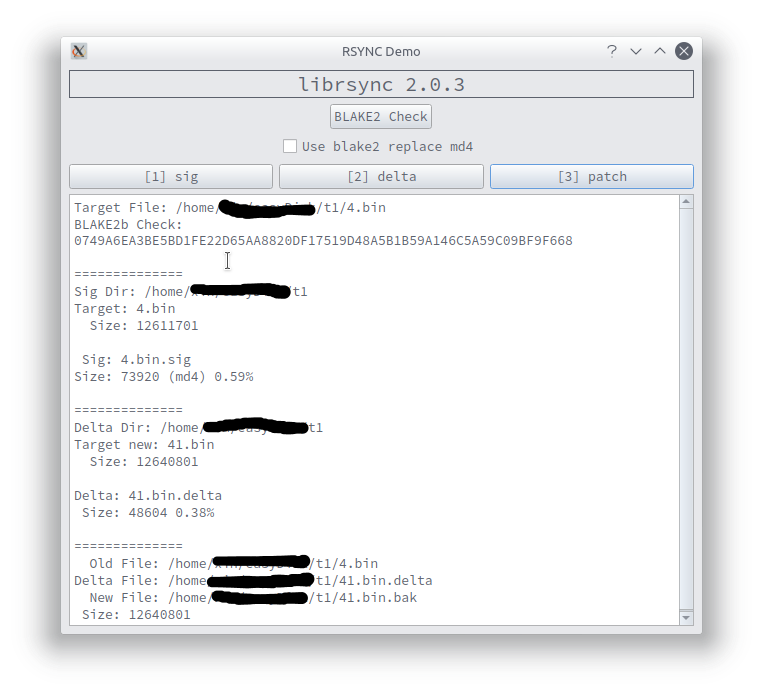

# rsyncDemo

使用[librsync](https://github.com/librsync/librsync)完成文件同步的核心操作，仅用于演示和测试。

其中：

- 文件一致校验使用librsync中使用的BLAKE2源码。

-  文件同步算法直接使用librsync进行，主要分为sig/delta/patch三步
- md4兼容<1.0库版本，blake2为新的推荐算法（blake2的sig会稍大）

效果截图：

# 参考资料

- <https://www.freebuf.com/articles/database/129260.html>
- <https://librsync.github.io/>

by BBDXF

2019-04-01 

